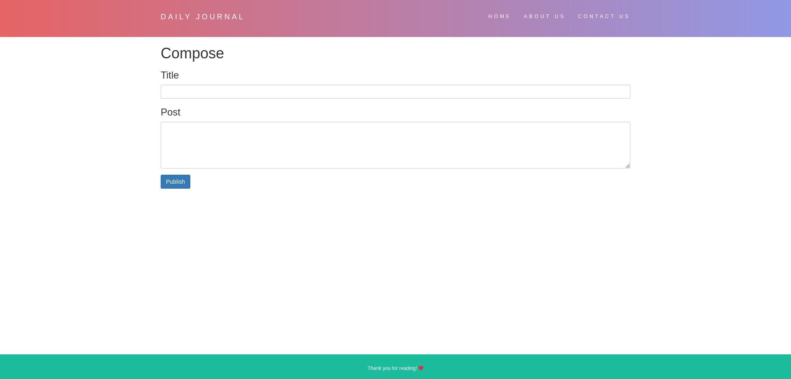
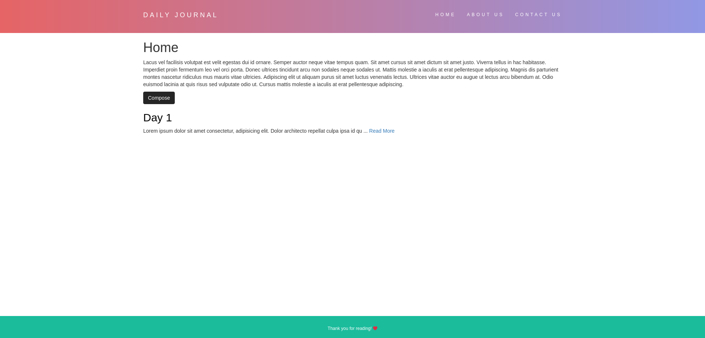
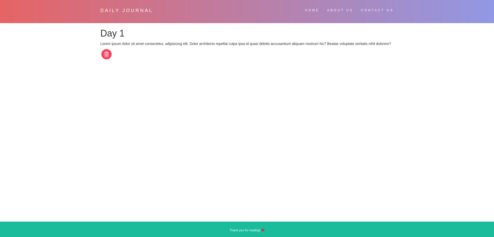

# Blog Website

Hi there! This is a small personal project I did to learn more about fullstack development.

## Table of contents
- [Overview](#overview)
  - [The challenge](#the-challenge)
  - [Screenshots](#screenshots)
  - [Links](#links)
- [My process](#my-process)
  - [Built with](#built-with)
- [Challenges Faced](#challenges-faced)

## Overview

### The challenge

- User should be able to compose new posts
- User should be able to delete existing posts
- The data added should be persistent

### Screenshots

### Links

- [Solution URL](https://github.com/ChrolloKryber/blogWebsite)
- [Live Site URL](https://easy-plum-katydid-yoke.cyclic.app/)

## My process

### Built with

- EJS Templating
- Node.js
- CSS Grid
- [MongoDB](https://www.mongodb.org)
- [Mongoose](https://mongoosejs.com/)
- Express

## Challenges Faced

This project was a very enlightening experience. I got to learn a lot during this period from Templating with EJS to saving data in a databse. This was a great experience for learning both front-end and back-end. 

As well as storing private data in environment variables and deploying with a database. Overall I had a great experience building this!

---

Icons from Flaticon